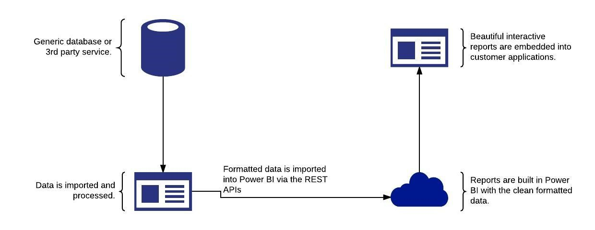
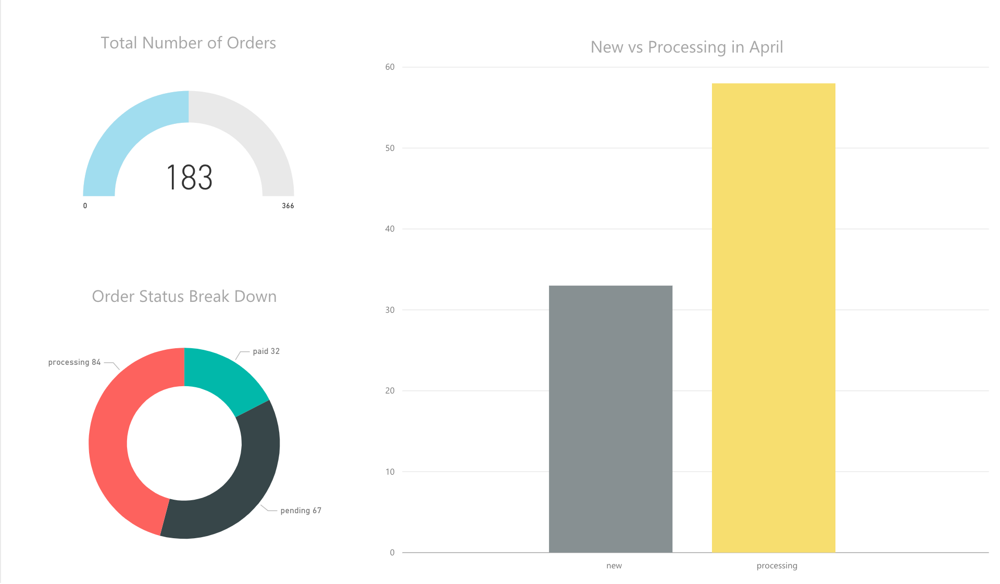

In May, Tangent Solutions and Microsoft gathered for a hackfest. Our goal was to explore and integrate Power BI into their own solutions. This included overcoming a couple of challenges, such as integrating into a solution built with PHP and ingesting data into Power BI from complex and dynamic data sources.

Because of the hackfest, the customer can now easily ingest data into Power BI through its new data feed platform and provide beautiful interactive reports in their existing applications thanks to Power BI. They explored the capabilities of Power BI as a platform for providing more interactive and up to date reports to their current B2B customers. During this process, they decided that the complex data structures modern eCommerce solutions tend to use - is a perfect use case for Power BI.

**Core team**:

- Zander Janse van Rensburg, Tech Lead, Tangent Solutions
- Eric Truter, Project Manager, Tangent Solutions
- Anders Gill, Technical Evangelist, Microsoft
- Francois Smith, Audience Evangelist Marketing Manager, Microsoft
- Morgan Webb, Independent Software Vendor (ISV) Lead, Microsoft
- Simon Jäger, Technical Evangelist, Microsoft

	 
## Customer profile

[Tangent Solutions](http://tangentsolutions.co.za/) is a specialist in digitizing business. There exists a massive need for a technical company to bridge the visual and user experience offering that traditional digitalization companies bring to the market and the engineering first offering that traditional IT development houses bring to the market. Tangent Solutions has positioned itself in the middle of these two value propositions, taking the best of breed from both.

Besides for offering a differentiated value proposition, Tangent Solutions further differentiates itself from traditional software development consulting houses by following a quality as opposed to a quantity business model. Their consultants are experts in their fields of specialization allowing them to deploy small teams who are geared and motivated to do the work required. Small highly skilled teams allow for greater engagement with the client, ensures that every person contributing to the code-base knows that they are doing and reduces the overhead of managing many people and stakeholders.

They have a strong research and development team constantly making sure that they are in alignment with industry trends and new technological developments. They adopt processes and strategies that make it easy to produce high quality products (and difficult to produce low quality ones). They are open source focused and enjoy participating in a fast paced and constantly changing technological ecosystem. 

Lately Tangent Solutions has started focusing it's efforts on providing more in depth and dynamic reports for the clients.
 
## Problem statement

As Tangent Solutions has clients spread across a wide range of industries using a wide range of technologies they needed a powerful reporting solution which is easy to use, but can also adapt to any data thrown at it.

Currently most of the systems they manage has some sort of built in reporting solution. This makes it extremely difficult to report on data from 3rd parties which is related to data in the system itself.

Key points highlighted by Tangent Solutions:

- They wanted to be able to report on complex data structures such as EAV
- The reports should be embeddable in a wide range of different tech stacks
- They wanted to easily pull in data from different systems

## Solution, steps, and delivery

As part of the solution the customer was looking for a clean way to ingest data into Power BI to make it easier to report on as well as gain some data sanity. To achieve this a new data feed platform was created. The data feed platform handles the exports from the external services, runs formatting and sanity checks, and finally exports it to Power BI through the Power BI REST API ([http://docs.powerbi.apiary.io](http://docs.powerbi.apiary.io)).



We decided to implement the solution in PHP. The language decision was made due to support by libraries they already had in place to communicate with their eCommerce systems.

The first stumbling block we encountered was authenticating with Azure AD (Azure Active Directory, [https://docs.microsoft.com/en-us/azure/active-directory/active-directory-whatis](https://docs.microsoft.com/en-us/azure/active-directory/active-directory-whatis)). Currently there is no official SDK available for PHP and a custom solution had to be created. We decided to go with the *resource owner password credentials grant* flow, using the Azure AD OAuth 2.0 token endpoint ([https://blogs.msdn.microsoft.com/wushuai/2016/09/25/resource-owner-password-credentials-grant-in-azure-ad-oauth/](https://blogs.msdn.microsoft.com/wushuai/2016/09/25/resource-owner-password-credentials-grant-in-azure-ad-oauth/)).

Using this grant flow, we can leverage the credentials of an Azure AD user - that had the necessary Power BI license assigned to it (e.g. Power BI Premium: [https://powerbi.microsoft.com/en-us/pricing/](https://powerbi.microsoft.com/en-us/pricing/)). 

> This works well as the solution will be used with trusted applications. This is one of the few and only scenarios where this grant flow should be used - as it's based on plain HTTP requests. 

Implementing this was easy enough and looked something like this:

```php
try {
	/** @var GuzzleHttp\Client $client **/
	$response = $client->post(
		'https://login.windows.net/<tenant-id>/oauth2/token',
		[
			"headers" => [
				"Accept" => "application/json"
			],
			'form_params' => [
				'resource'      => 'https://analysis.windows.net/powerbi/api',
				'client_id'     => $this->clientId,
				'client_secret' => $this->secret,
				'grant_type'    => 'password',
				'username'      => $this->username,
				'password'      => $this->password,
				'scope'         => 'openid',
			]
		]
	);

	$body = json_decode($response->getBody()->getContents(), true);
	return $body['access_token'];
} catch (ClientException $e) {
	return ['error' => $e->getMessage()];
}
```

The access token returned from the above code was then added to the *Authorization* header to authenticate all the requests to the Power BI REST API.

The next step was to get the formatted data into Power BI. We used Guzzle ([http://docs.guzzlephp.org/en/latest/](http://docs.guzzlephp.org/en/latest/)), a PHP HTTP client for making the requests. Again, this was surprisingly easy and was achieved with the following code:

```php
try {
	/** @var GuzzleHttp\Client $client **/
	$client->post(
		https://api.powerbi.com/v1.0/myorg/groups/<group-id>/datasets/<dataset-id>/tables/<table-name>/rows,
		[
			'headers' => [
				"Accept"        => "application/json",
				"Authorization" => sprintf("Bearer %s", $token),
			],
			'json'    => $data
		]
	);

	return true;
} catch (ClientException $e) {
	return false;
}
```

The last step to the process was getting the embedding to work. We decided to embed it into an existing web application by using the [PowerBI Javascript SDK](https://github.com/Microsoft/PowerBI-JavaScript). The first part of the embedding required a container:

```html
<div class="container">
	<div class="row">
		<div class="col-md-12">
			<div id="reportContainer" style="height: 600px"></div>
		</div>
	</div>
</div>
```

Once that was set up, the following code embedded the report:

```js
var models = window['powerbi-client'].models;
var config = {
    type: 'report',
    accessToken: '<access_token>' // Token received in the first code block above
    embedUrl: 'https://embedded.powerbi.com/reportEmbed?reportId=<report_id>&groupId=<group_id>',
    id: '{{ report }}',
    permissions: models.Permissions.All,
    settings: {
        filterPaneEnabled: true,
        navContentPaneEnabled: true
    }
};
var reportContainer = $('#reportContainer')[0];
var report = powerbi.embed(reportContainer, config);
```

> Please note that embed tokens, rather than access tokens should be used by the client to embed reports. This was not available at the time of writing, and outside the scope of the solution. See the conclusion for more information about this.

Below is an example of a live, interactive report built from the ingested data from Magento:


 
## Conclusion

At the end of the event, we could prove that the scenario works. A new data feed platform was created, which could ingest data into the Power BI ecosystem from this very dynamic world that the customer started in. The ingestions were successfully able to format and validate the data before entering the Power BI service. In the future, the customer is considering expanding this data feed platform to support multiple types of data sources - both for ingestion and egestion. 

This illustrated a perfect case, where even the most dynamic of data sources can be dealt with - allowing for anyone to take their data and leverage Power BI to gain insights and knowledge about it. Ultimately, this gives the ability for anyone to embed and integrate powerful visualizations and reporting into their own solutions.

Additionally, the solution showcased proper interaction between open-source/non-Microsoft tools and frameworks with the Power BI service. 

What should be noted is that we leveraged the access token, issued for the application by Azure AD. This access token has more privileges that needed (such as full access to the Power BI REST API), and should not be sent to the client side for embedding the reports in production. At the time of writing, the ability to generate embed tokens used for only embedding the reports is not yet available ("More information regarding the embed token will be made available soon." - [https://powerbi.microsoft.com/en-us/documentation/powerbi-developer-using-embed-token/](https://powerbi.microsoft.com/en-us/documentation/powerbi-developer-using-embed-token/)).

However, there's no need to modify the existing code to use embed tokens (once available). As they are provided when embedding the reports in the same way as the access token. This will make the transition smooth, while still allowing us to validate and experiment with the functionality.

By embedding straight into the user experience, we allow for the end users to stay in their flow - without having to jump between experiences. Furthermore, we can make sure to provide the right Power BI experience, at the right time. While also filtering the data per customer, allowing for multi-tenant scenarios with row-level security ([https://powerbi.microsoft.com/en-us/documentation/powerbi-admin-rls/](https://powerbi.microsoft.com/en-us/documentation/powerbi-admin-rls/)).

In short, a very successful solution executed within a very short timeframe.

> It is our belief that Digital Transformation without intelligence is stabbing in the dark. The data feed platform created during the workshop has helped us to lay the foundations for a massive value add for our customers and we hope the broader development community as well.
>
> Dave Nel, CEO Tangent Solutions, Microsoft Regional Director

## Additional resources

- Tangent Solutions: [http://www.tangentsolutions.co.za/](http://www.tangentsolutions.co.za/)
- Embedding with Power BI: [https://powerbi.microsoft.com/en-us/documentation/powerbi-developer-embedding/](https://powerbi.microsoft.com/en-us/documentation/powerbi-developer-embedding/)
- Code samples: [https://github.com/powerbi](https://github.com/powerbi)